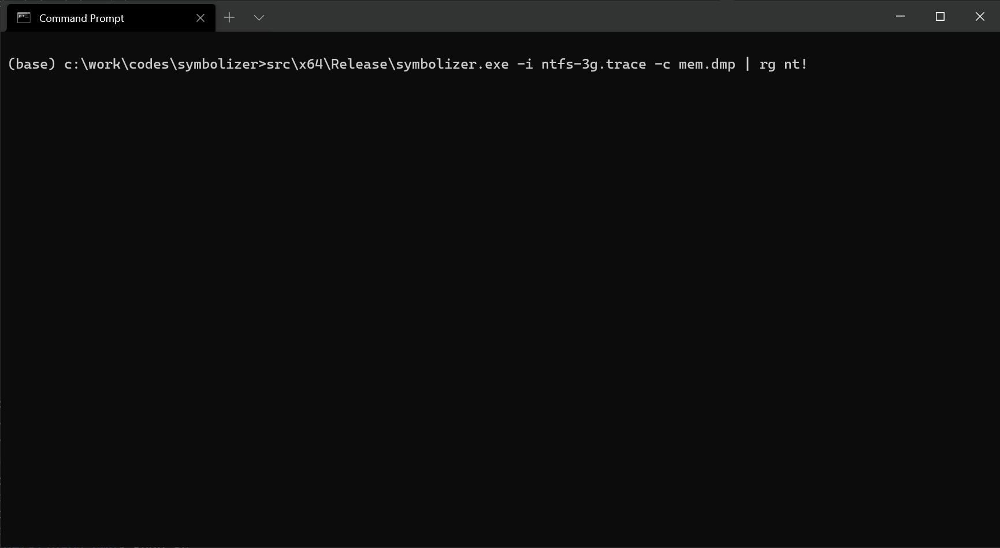
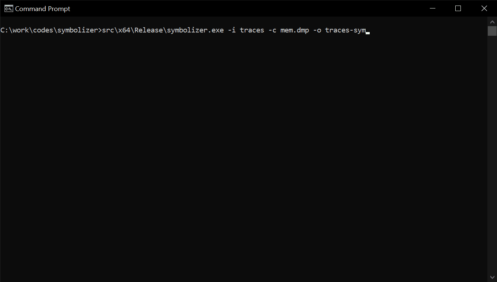
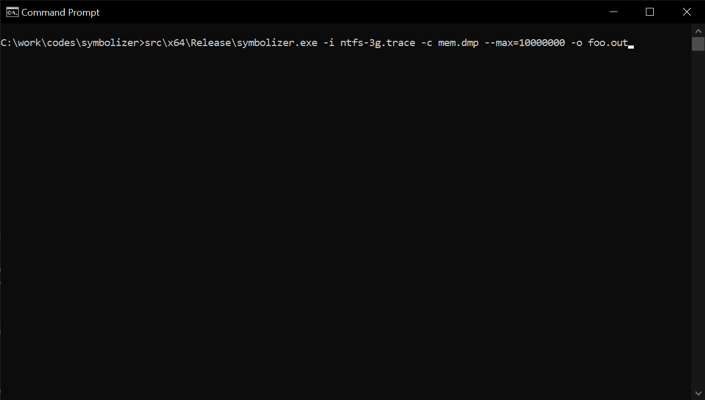

# Symbolizer - A fast execution trace symbolizer for Windows




## Overview

This is utility that symbolizes an execution trace via the [dbghelp](https://docs.microsoft.com/en-us/windows/win32/debug/debug-help-library) APIs and a crash-dump. The dbghelp APIs are used to load the crash-dump and symbolizes RIP values by querying available symbols and the crash-dump is used as a reference of the address space.

Transform the below raw execution trace:

```
0xfffff8053b9ca5c0
0xfffff8053b9ca5c1
0xfffff8053b9ca5c8
0xfffff8053b9ca5d0
0xfffff8053b9ca5d4
0xfffff8053b9ca5d8
0xfffff8053b9ca5dc
0xfffff8053b9ca5e0
```

Into a full symbolized trace:

```
nt!KiPageFault+0x0
nt!KiPageFault+0x1
nt!KiPageFault+0x8
nt!KiPageFault+0x10
nt!KiPageFault+0x14
nt!KiPageFault+0x18
nt!KiPageFault+0x1c
nt!KiPageFault+0x20
```

Or a `mod+offset` trace to load it into [Lighthouse](https://github.com/gaasedelen/lighthouse) for code-coverage exploration:

```
nt+0x1ca5c0
nt+0x1ca5c1
nt+0x1ca5c8
nt+0x1ca5d0
nt+0x1ca5d4
nt+0x1ca5d8
nt+0x1ca5dc
nt+0x1ca5e0
nt+0x1ca5e4
nt+0x1ca5e8
```

## Usage

In order for symbolizer to work you need to place `dbghelp.dll` as well as `symsrv.dll` in the directory of the symbolizer executable. Symbolizer will copy the two files if they are found in the default Windows SDK's Debuggers install location: `c:\Program Files (x86)\Windows Kits\10\Debuggers\<arch>`.

```
Symbolizer - A fast execution trace symbolizer for Windows
Usage: src\x64\Release\symbolizer.exe [OPTIONS]

Options:
  -h,--help                   Print this help message and exit
  --help-all                  Expand all help
  -i,--input TEXT:PATH(existing) REQUIRED
                              Input trace file or directory
  -c,--crash-dump TEXT:FILE REQUIRED
                              Crash-dump path
  -o,--output TEXT            Output trace (default: stdout)
  -s,--skip UINT=0            Skip a number of lines
  -m,--max UINT=20000000      Stop after a number of lines
  --style ENUM:value in {modoff->0,fullsym->1} OR {0,1}=fullsym
                              Trace style
  --overwrite=0               Overwrite the output file if necessary
  --line-numbers=0            Include line numbers
```

### Batch mode

The batch mode is designed to symbolize an entire directory filled with execution traces. You can turn on batch mode by simply specifying a directory for the `--input` command line option and an output directory for the `--output` option.



### Single file mode

As opposed to batch mode, you might be interested in just symbolizing a single trace file which in this case you can specify a file path via the `--input` command line option.



## Build

Clone the repository with:

```
(base) > git clone --recurse-submodules https://github.com/0vercl0k/symbolizer.git
```

You can open the Visual Studio solution `symbolizer.sln` or build it via the command line with:

```
(base) symbolizer>msbuild /p:Configuration=Release src\symbolizer.sln
Microsoft (R) Build Engine version 16.7.0+b89cb5fde for .NET Framework
Copyright (C) Microsoft Corporation. All rights reserved.

[...]

Build succeeded.
    0 Warning(s)
    0 Error(s)

Time Elapsed 00:00:00.42
```
